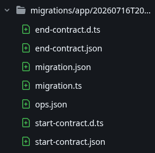
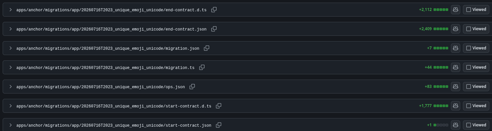
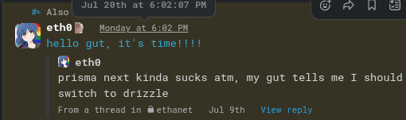
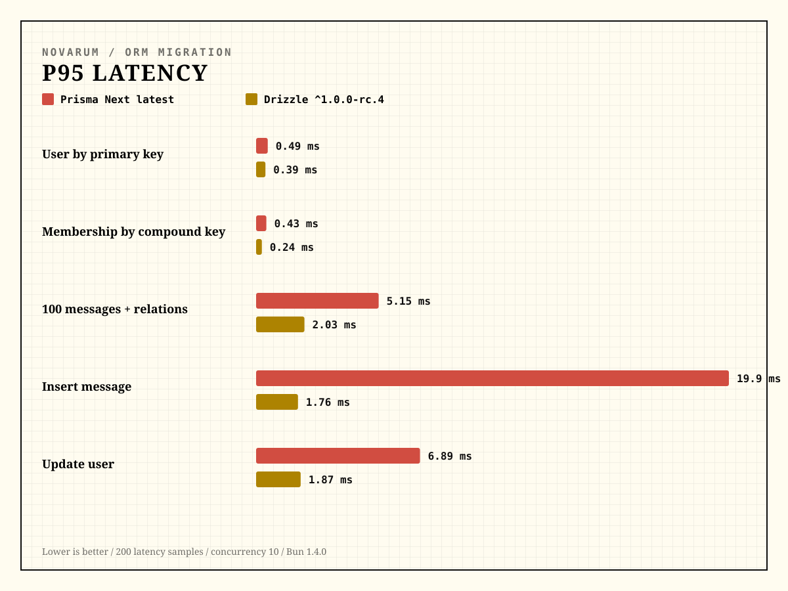
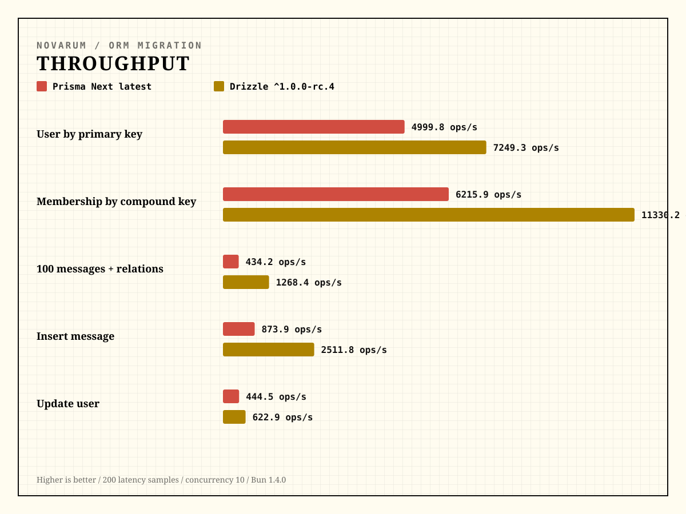

import MdxAccordion from '@/components/MdxAccordion.astro'

# how it all started

this summer i was very convinced that i needed a better chat app than whatever discord has turned into - what are orbs? free nitro with your data? ID VERFICATION??????????  
and so [novarum](https://github.com/novarumsocial/novarum) was created.

the tech stack is quite simple yet effective: sveltekit for the frontend, elysia on the backend, all glued up with elysia's eden package (some kind of trpc but without the headaches!)

as for the ORM, i really liked prisma, so why not try the [new version](https://www.prisma.io/blog/the-next-evolution-of-prisma-orm) that was apparently head-to-head with drizzle?

## the prisma-next experience

first off, it introduces a new concept - contracts. it's actually just the schema but with a cornier name, and a shit ton of files when you had to write a migration  
  
of a [7432 addition pull request](https://github.com/novarumsocial/novarum/pull/6), 6433 lines were for just the migration  


there was also another issue: where are the docs? the only information i found was the blog announcement (link above) and that's about it.  
guess what the installation script created for me? that's right: [ai agent skills](https://github.com/novarumsocial/novarum/tree/landmark/before-drizzle/.agents/skills). those are the only docs i could find, apart from their [documentation website](https://www.prisma.io/docs/orm/next) which i have solid amount of suspicion that it's just the ai skill markdown files on the website.

don't get me wrong, i'm not one of those big ai haters. i use it a lot and it saves me a lot of time, even if i have to usually go after it cleaning up ugly code and such. it's just **very** frustrating that i have to ask an ai agent how you make a query instead of looking at good old docs.

## giving up

i had already thought about migrating to drizzle on the very early days of the project, so last july 20th i reached my boiling point and started working on a migration  


with a quick `drizzle-kit pull`, i was able to port the entire prisma schema to a drizzle migration by introspecting the development database, used ai to refactor the entire schema to drizzle, and ran `drizzle-kit generate` to generate a migration for all the new and refactored indexes, while also adding one or two more columns here or there!

the entire schema migration ended up being quite painless, and the following days i spent some time mechanically migrating all prisma-next queries to their drizzle counterpart.  
and, i have to say, that wasn't very hard. prisma-next queries are similar to drizzle, with some notable exceptions, such as `.where()` coming after the operation on drizzle, instead of before the operation on prisma, and the upsert function outright not existing.

```ts
// prisma guild invite deletion
await db.orm.public.GuildInvite.where({
  guildId,
  creatorId: session.userId,
}).delete()

// drizzle guild invite deletion
await db
  .delete(guildInvites)
  .where(
    and(
      eq(guildInvites.guildId, guildId),
      eq(guildInvites.creatorId, session.userId),
    ),
  )
```

```ts
// prisma way of upserting (quite clear!)
await db.orm.public.ChannelReadState.upsert({
  create: {
    userId: session.userId,
    channelId: params.id,
    lastReadCreatedAt: createdAt,
    lastReadMessageId: body.messageId,
  },
  update: {
    lastReadCreatedAt: createdAt,
    lastReadMessageId: body.messageId,
  },
})

// drizzle way of upserting (you'll understand it if you look at it long enough)
// ... or maybe i don't know databases and i sincerely apologize.
await db
  .insert(channelReadStates)
  .values({
    userId: session.userId,
    channelId: params.id,
    lastReadCreatedAt: createdAt,
    lastReadMessageId: body.messageId,
  })
  .onConflictDoUpdate({
    target: [channelReadStates.userId, channelReadStates.channelId],
    set: {
      lastReadCreatedAt: createdAt,
      lastReadMessageId: body.messageId,
    },
  })
```

the migration also came with some miscellaneous improvements, such as [running migrations programatically](https://github.com/novarumsocial/novarum/blob/ea8352875f4ed57dcf0133192f120c8eebf16dbe/apps/anchor/src/index.ts#L25-L32) and smaller docker images (from copying files and `bun run src/index.ts` to `bun build`ing a single binary and running that on a distroless image)

## post-mortem benchmarks

i gave ai the job of running some benchmarks just out of curiosity.  
results were quite surprising, but all this is very not scientific and should be taken with a grain of salt. scroll down with discretion.

<MdxAccordion title="method and boring stuff">
    - 100 messages in the relation fixture
    - 20 warmup operations and 200 measured latency operations per scenario
    - 500 throughput operations at concurrency 10
    - Runtime: Bun 1.4.0
    - Machine: AMD Ryzen 7 PRO 5750G with Radeon Graphics (16 logical cores)
    - Database host: localhost:15432

    **Versions**:
    - Prisma Next latest: commit `8c810255cafd`, 2026-07-24T20:30:21.983Z
    - Drizzle ^1.0.0-rc.4: commit `8d700dfd9695`, 2026-07-24T20:30:06.182Z
</MdxAccordion>


it actually looks quite impressive! drizzle kept quite a big margin when inserting and updating users, which is very nice to see.


this also looks very interesting. i don't think i'll have performance issues when querying guild members :'D

## the end

i've never been a huge fan of drizzle, but looking at prisma's direction, from an orm i used since day one to documentation inside agent skills, i think i'll stick to drizzle. it has also been growing on me quite lately!

btw: no hate to the prisma team, i know they are working hard on prisma-next, i wish them the best of luck and will definitely revisit it. but for me, it's time to move on for now <3